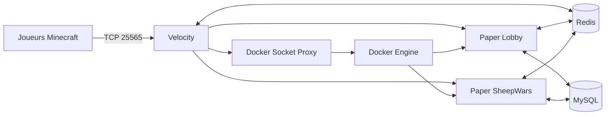

# Architecture et fonctionnement

## Vue d'ensemble

Velocity est l'unique point d'entrée public. Le plugin `tropicube-velocity` maintient un catalogue d'instances, restaure celles qui existent encore après son redémarrage, crée les conteneurs nécessaires et les enregistre dynamiquement auprès du proxy. Les serveurs Paper exécutent `TropicubeCore` et leur plugin spécialisé.

Deux réseaux Docker séparent les flux :

- `tropicube-net` relie Velocity, Redis, MySQL et les serveurs de jeu ;
- `tropicube-control`, interne, relie uniquement Velocity au proxy du socket Docker.

## Cycle d'une instance

1. Au démarrage, Velocity charge les templates puis restaure les instances encore décrites dans Redis et Docker.
2. Il garantit `min-instances` pour chaque template activé avec `auto-start`.
3. `DockerManager` réserve les ports, crée le conteneur, injecte son environnement, ses labels et ses volumes, puis le démarre.
4. `TropiServerManager` attend que le backend soit joignable avant de l'enregistrer auprès de Velocity.
5. Les comptes de joueurs et l'état de l'instance sont actualisés dans Redis.
6. À la fin d'une partie, le backend demande sa clôture à Velocity. Le proxy réessaie les transferts tant que tous les joueurs ne sont pas revenus au lobby, puis tue et supprime immédiatement le conteneur.
7. Une instance vide et éligible à `auto-stop` est arrêtée après `auto-stop-delay`, sans descendre sous `min-instances`.
8. Velocity sonde toutes les 10 secondes les backends prêts. Après 60 secondes sans réponse, il force la suppression du conteneur, de son entrée Velocity et de toutes ses références Redis connues.

Le cycle nominal utilise `CREATING`, `STARTING`, `GAME_WAITING`, `GAME_STARTING`, `GAME_PLAYING`, `GAME_ENDING`, `STOPPING` et `STOPPED`, avec `ERROR` comme sortie d'échec. Une instance n'est joignable que si son état et sa capacité le permettent.

## Responsabilités des modules

### `tropicube-docker-api`

Bibliothèque commune ombrée dans les plugins qui en ont besoin :

- `ServerTemplate` valide la définition d'un type de serveur ;
- `ServerInstance` représente une exécution concrète et son état ;
- `DockerManager` réserve les ports, crée, inspecte, arrête et nettoie les conteneurs ;
- `RedisManager` centralise le préfixage, la sérialisation JSON, les transactions et les abonnements avec reconnexion.

Les clients Docker et Redis sont fermables. Les abonnements Redis, bloquants par nature, tournent dans des threads virtuels et se réabonnent après une coupure tant que le gestionnaire reste actif.

### `tropicube-velocity`

Le plugin proxy :

- initialise Redis et le client Docker via le socket proxy ;
- charge les templates de `config.yml` ;
- crée, restaure, surveille et retire les serveurs dynamiques ;
- choisit le lobby le moins chargé à la connexion et comme solution de repli ;
- gère les files VIP, les transferts et leurs erreurs ;
- applique la whitelist d'une partie personnalisée ;
- propose les commandes réseau et l'identité `/nick`.

Le redéploiement normal conserve les backends (`shutdown.stop-dynamic-servers: false`) afin qu'un redémarrage de Velocity ne détruise pas les parties actives.

### `tropicube-core`

Plugin obligatoire sur chaque backend Paper. Son ordre d'initialisation est volontaire : configuration, MySQL, Redis, langues, permissions/grades, économie, données joueurs, HeadDatabase, commandes et listeners.

Il fournit :

- le profil et la langue du joueur ;
- les grades, priorités et permissions calculées ;
- l'économie et l'historique des transactions ;
- les sanctions de modération ;
- le formatage du chat et des pseudos ;
- une API Java typée consommée par Lobby et SheepWars.

Les accès MySQL potentiellement longs sont exécutés hors du thread principal dans les flux de connexion, de commande et de boutique. Les modifications Bukkit reviennent ensuite sur le thread serveur.

### `tropicube-lobby`

Le lobby prépare le joueur, fournit son inventaire de navigation et rafraîchit les données d'instances depuis Redis. Ses interfaces permettent de :

- sélectionner un type et une instance ;
- créer ou arrêter une partie personnalisée lorsque le joueur en est l'hôte ;
- changer de langue ;
- acheter un grade VIP avec compensation du débit si l'attribution échoue ;
- utiliser un, deux ou une infinité de doubles-sauts selon les permissions ;
- rejoindre la prochaine partie proposée après un match.

Le matchmaking classique est coordonné par Velocity par template. Tant qu'une création est en cours, les clics du menu et les demandes `/playnext` réutilisent la même `CompletableFuture` au lieu de créer un conteneur supplémentaire. Les UUID sont conservés dans une file FIFO dédupliquée en mémoire, puis transférés automatiquement quand l'instance est enregistrée. Si sa capacité ne suffit pas, les joueurs restants déclenchent une unique instance suivante. Ce mécanisme ne s'applique ni aux parties personnalisées ni aux créations administratives.

HeadDatabase est optionnel au moment précis du rendu : une icône Material ou une tête générique est utilisée tant que sa base n'est pas chargée.

### `tropicube-sheepwars`

Une instance SheepWars suit les phases attente, sélection, compte à rebours, jeu et fin. Le module gère :

- les cartes et points d'apparition rouges/bleus ;
- le choix ou vote de carte ;
- la sélection des équipes, classes et kits ;
- les règles forcées ou personnalisées ;
- les scores et statistiques persistantes ;
- les moutons spéciaux pondérés par configuration ;
- le retour au lobby et la proposition de revanche.

Les types inclus sont Boarding, TNT, Distort, Darkness, Searching, Fire, Poison, Swap, Meteor, Healing, Lightning, Gravity, Mecha, Strength et Fragmentation.

### `tropicube-fallenkingdoms`

Ce module est pour l'instant un squelette Maven sans classe, ressource, dépendance Paper ni intégration Docker. Il participe au build global pour réserver son identité, mais n'est pas un plugin installable. Son futur déploiement nécessitera au minimum une classe `JavaPlugin`, un `plugin.yml`, une dépendance Paper/Core, une configuration, une image et un template Velocity.

## Contrats Redis

`RedisManager` préfixe automatiquement les clés avec `tropicube:`. Les appels applicatifs utilisent donc les noms logiques ci-dessous.

| Clé ou canal logique | Producteur | Consommateur | Fonction |
|---|---|---|---|
| `instance:<id>` | Velocity | Tous | JSON de l'instance |
| `instances:active` | Velocity | Lobby/Velocity | Ensemble des identifiants actifs |
| `instances:type:<type>` | Velocity | Lobby/Velocity | Index par type |
| canal `servers` | Velocity | Intégrations | `SERVER_STARTED` / `SERVER_STOPPED` |
| canal `commands` | Lobby/SheepWars/Velocity | Velocity | Commandes ciblées, notamment `PROXY:CONNECT:<uuid>:<serveur>` et `PROXY:FINISH_GAME:<instanceId>` |
| canal `players` | Velocity | Intégrations | Changements de serveur d'un joueur |
| `transfer:<uuid>` | Velocity | Core/Lobby | Marqueur court évitant de traiter un transfert comme une première arrivée |
| `host:<uuid>` | Velocity | Lobby/SheepWars | Partie personnalisée administrée par le joueur |
| `host-creation:<uuid>` | Velocity | Lobby/Velocity | Verrou atomique et temporaire empêchant deux créations personnalisées simultanées |
| `post-game:<uuid>` | SheepWars | Lobby | Cible et type proposés par `/playnext`, TTL 120 s |
| `nick:<uuid>` | Velocity | Core | Pseudonyme et skin actifs |
| langue/grade/cache joueur | Core | Core/Velocity | Accélération et synchronisation du profil |

Les messages de transfert ne doivent jamais appeler Bukkit depuis le thread d'abonnement Redis. Chaque plugin planifie les opérations d'entité ou d'inventaire sur le thread Paper.

La purge d'une instance supprime atomiquement son document et ses index principaux, puis balaie les références secondaires connues (`host`, serveur courant, reconnexion, abandon, revanche et post-partie). Chaque référence est relue avant suppression afin de ne pas effacer une valeur réaffectée concurremment à une autre instance.

Un changement de langue publie `LANG_CHANGED:<uuid>:<langue>` sur le canal joueurs. Le lobby reconstruit alors, sur le thread Paper, la hotbar, le scoreboard personnel et la tablist. Le scoreboard du lobby est donc entièrement localisé et reste cohérent que la langue soit changée depuis le menu ou avec `/lang`.

## Persistance MySQL

`DatabaseManager` crée et fait évoluer les tables suivantes au démarrage :

- `tropicube_players` : identité, langue et métadonnées du joueur ;
- `tropicube_economy` : solde courant ;
- `tropicube_transactions` : journal des mouvements ;
- `tropicube_sanctions` : mutes, avertissements et expulsions ;
- `tropicube_grades` : définition des grades ;
- `tropicube_permissions` : permissions individuelles temporaires ou permanentes ;
- `tropicube_sheepwars` : statistiques du mini-jeu.

Les grades déclarés dans la configuration Core sont resynchronisés au démarrage. Une modification manuelle en base ou via la sous-commande de définition de grade peut donc être écrasée par la configuration au prochain redémarrage.

## Sécurité réseau

- Velocity authentifie les comptes (`online-mode = true`).
- Les backends Paper sont hors ligne car ils font confiance au forwarding moderne de Velocity.
- `paper-global.yml` exige le même `FORWARDING_SECRET` que `forwarding.secret` côté proxy.
- Redis et MySQL ne sont publiés que sur la boucle locale de l'hôte.
- Le proxy Docker limite les familles d'appels exposées et utilise `no-new-privileges`.
- Les conteneurs dynamiques reçoivent uniquement les secrets nécessaires via leur environnement.
