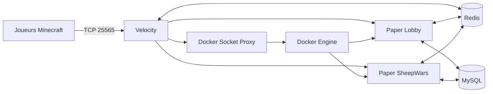

# Architecture et fonctionnement

## Vue d'ensemble

Velocity est l'unique point d'entrée public. Le plugin `tropicube-velocity` maintient un catalogue d'instances, restaure celles qui existent encore après son redémarrage, crée les conteneurs nécessaires et les enregistre dynamiquement auprès du proxy. Les serveurs Paper exécutent `TropicubeCore` et leur plugin spécialisé.

Deux réseaux Docker séparent les flux :

- `tropicube-net` relie Velocity, Redis, MySQL et les serveurs de jeu ;
- `tropicube-control`, interne, relie uniquement Velocity au proxy du socket Docker.

## Cycle d'une instance

1. Au démarrage, Velocity charge les templates puis restaure les instances encore décrites dans Redis et Docker.
2. Il garantit `min-instances` pour chaque template activé avec `auto-start`.
3. `DockerManager` réserve les ports, crée le conteneur, injecte son environnement, ses labels et ses volumes, puis le démarre.
4. `TropiServerManager` attend que le backend soit joignable avant de l'enregistrer auprès de Velocity.
5. Les comptes de joueurs et l'état de l'instance sont actualisés dans Redis.
6. À la fin d'une partie, le backend demande sa clôture à Velocity. Le proxy réessaie les transferts tant que tous les joueurs ne sont pas revenus au lobby, puis tue et supprime immédiatement le conteneur.
7. Une instance vide et éligible à `auto-stop` est arrêtée après `auto-stop-delay`, sans descendre sous `min-instances`.
8. Velocity sonde toutes les 10 secondes les backends prêts. Après 60 secondes sans réponse, il force la suppression du conteneur, de son entrée Velocity et de toutes ses références Redis connues.

Les créations classiques SheepWars ne sont pas limitées à `min-instances` : dès qu'aucune instance `GAME_WAITING` ou `GAME_STARTING` n'a de place, le matchmaking partage une nouvelle création entre les joueurs en attente, jusqu'à `max-instances`. Une seule création simultanée par template est lancée afin d'éviter les doublons, puis une création suivante peut démarrer si des joueurs restent en attente.

À la fin d'une partie, seul un serveur classique sans `HOST_UUID` demande la précréation de sa relève. Une instance personnalisée s'arrête sans publier de demande `CREATE_GAME`, afin qu'une session privée ne déclenche pas une partie publique ou un conteneur inutile.

Le cycle nominal utilise `CREATING`, `STARTING`, `GAME_WAITING`, `GAME_STARTING`, `GAME_PLAYING`, `GAME_ENDING`, `STOPPING` et `STOPPED`, avec `ERROR` comme sortie d'échec. Une instance n'est joignable que si son état et sa capacité le permettent.

Si un arrêt Docker échoue alors que le conteneur reste actif, Velocity restaure l'état jouable antérieur dans son registre et dans Redis. Le Lobby exclut `STOPPING`, `STOPPED` et `ERROR` de ses listes et de ses totaux ; ses menus ne comptent ainsi que les instances en démarrage ou dans un état de jeu actif.

## Responsabilités des modules

### `tropicube-docker-api`

Bibliothèque commune ombrée dans les plugins qui en ont besoin :

- `ServerTemplate` valide la définition d'un type de serveur ;
- `ServerInstance` représente une exécution concrète et son état ;
- `DockerManager` réserve les ports, crée, inspecte, arrête et nettoie les conteneurs ;
- `RedisManager` centralise le préfixage, la sérialisation JSON, les transactions et les abonnements avec reconnexion.

Les clients Docker et Redis sont fermables. Les abonnements Redis, bloquants par nature, tournent dans des threads virtuels et se réabonnent après une coupure tant que le gestionnaire reste actif.

### `tropicube-velocity`

Le plugin proxy :

- initialise Redis et le client Docker via le socket proxy ;
- charge les templates de `config.yml` ;
- crée, restaure, surveille et retire les serveurs dynamiques ;
- choisit le lobby le moins chargé à la connexion et comme solution de repli ;
- gère les files VIP, les transferts et leurs erreurs ;
- détient l'autorité de la whitelist d'une partie personnalisée, pour la commande, le menu et chaque tentative de connexion ;
- propose les commandes réseau et l'identité `/nick`.

À l'arrêt propre de Velocity, le comportement par défaut (`shutdown.stop-dynamic-servers: true`) arrête et supprime tous les conteneurs dynamiques. Chaque instance possède un volume `/data` éphémère nommé à partir de son identifiant et étiqueté `fr.tropicube.dynamic=true`. Velocity le supprime explicitement avec le conteneur et balaie au démarrage les volumes Tropicube devenus orphelins, même si leur conteneur a disparu brutalement. Les anciens volumes anonymes encore attachés sont également demandés à la suppression. Les volumes nommés de MySQL et Redis sont hors de ce périmètre et restent persistants. Un redéploiement qui doit préserver les parties peut temporairement utiliser la valeur `false` ; les backends sont alors restaurés au démarrage suivant.

Les images Lobby et SheepWars préparent Paper au build : `mc-image-helper` télécharge le build épinglé, puis Paperclip en mode `patchonly` récupère le JAR Mojang et génère le runtime sans démarrer de monde. L'image finale embarque le JAR Paper, `cache/mojang_<version>.jar` et `versions/<version>/paper-<version>.jar` dans `/data`. Docker recopie ce contenu initial dans chaque nouveau volume dynamique vide ; le démarrage d'une instance ne télécharge donc plus le serveur. Le volume reste entièrement propre à l'instance et continue d'être supprimé avec elle.

Le répertoire d'exécution `/server` du proxy est monté en `tmpfs`. Son contenu est initialisé à chaque démarrage depuis `/opt/tropicube/server`, embarqué dans l'image, puis disparaît automatiquement à l'arrêt du conteneur. Velocity ne crée donc plus de volume anonyme persistant. Les scripts de déploiement détectent et suppriment une dernière fois l'ancien volume `/server` lors de la migration.

L'arrêt d'un conteneur est réconcilié avec son état Docker réel. Si le proxy de socket perd la réponse HTTP après avoir transmis la commande, Velocity vérifie si le conteneur est déjà arrêté ; sinon il retente une fois. L'instance n'est marquée en erreur que si les deux commandes échouent et que Docker la voit toujours active.

### `tropicube-core`

Plugin obligatoire sur chaque backend Paper. Son ordre d'initialisation est volontaire : configuration, MySQL, Redis, langues, permissions/grades, économie, données joueurs, HeadDatabase, commandes et listeners.

Il fournit :

- le profil et la langue du joueur ;
- les grades, priorités et permissions calculées ;
- l'économie et l'historique des transactions ;
- les sanctions de modération ;
- le formatage du chat et des pseudos ;
- une API Java typée consommée par Lobby et SheepWars.

Les accès MySQL potentiellement longs sont exécutés hors du thread principal dans les flux de connexion, de commande et de boutique. Les modifications Bukkit reviennent ensuite sur le thread serveur.

### `tropicube-lobby`

Le lobby prépare le joueur, fournit son inventaire de navigation et rafraîchit les données d'instances depuis Redis. Ses interfaces permettent de :

- sélectionner un type et une instance ;
- créer ou arrêter une partie personnalisée lorsque le joueur en est l'hôte ;
- changer de langue ;
- acheter un grade VIP avec compensation du débit si l'attribution échoue ;
- utiliser un, deux ou une infinité de doubles-sauts selon les permissions ;
- rejoindre la prochaine partie proposée après un match.

Une vue d'instance privée contient son indicateur de confidentialité et les UUID admis. Le lobby filtre cette vue avant les compteurs, la pagination, le meilleur serveur et le clic final : une partie privée n'est donc jamais rendue pour un joueur non admis. Velocity répète néanmoins le contrôle dans `ServerPreConnectEvent`, qui constitue la frontière de sécurité.

Le matchmaking classique est coordonné par Velocity par template. Tant qu'une création est en cours, les clics du menu et les demandes `/playnext` réutilisent la même `CompletableFuture` au lieu de créer un conteneur supplémentaire. Les UUID sont conservés dans une file FIFO dédupliquée en mémoire, puis transférés automatiquement quand l'instance est enregistrée. Si sa capacité ne suffit pas, les joueurs restants déclenchent une unique instance suivante. Ce mécanisme ne s'applique ni aux parties personnalisées ni aux créations administratives.

HeadDatabase est optionnel au moment précis du rendu : une icône Material ou une tête générique est utilisée tant que sa base n'est pas chargée.

### `tropicube-sheepwars`

Une instance SheepWars suit les phases attente, sélection, compte à rebours, jeu et fin. Le module gère :

- les cartes et points d'apparition rouges/bleus ;
- le choix ou vote de carte ;
- la sélection des équipes, classes et kits ;
- les règles forcées ou personnalisées ;
- l'item et les inventaires de whitelist de l'hôte privé, dont les lectures Redis sont exécutées hors du thread Paper ;
- les scores et statistiques persistantes ;
- les moutons spéciaux issus d'une table de poids immuable filtrant les types désactivés, d'un tirage pondéré indépendant à chaque remise et d'une échéance propre à chaque joueur qui reste due tant que son stock est plein ;
- le retour au lobby et la proposition de revanche.

Les types inclus sont Boarding, TNT, Distort, Darkness, Searching, Fire, Poison, Swap, Meteor, Healing, Lightning, Gravity, Mecha, Strength et Fragmentation.

Les explosions offensives séparent désormais trois responsabilités : l'explosion Paper produit l'effet visuel et la destruction éventuelle des blocs, `PlayerListener` annule ses dégâts natifs pendant l'exécution contrôlée, puis le gestionnaire applique aux seuls ennemis un dégât radial linéaire configuré. Cette séparation empêche les doubles dégâts, dissocie le bonus du kit DPS du rayon et permet aux capacités multiples comme Fragmentation de partager un plafond par cible. Les valeurs sont chargées et validées une fois au démarrage depuis `gameplay-balance`.

### `tropicube-fallenkingdoms`

Ce module est pour l'instant un squelette Maven sans classe, ressource, dépendance Paper ni intégration Docker. Il participe au build global pour réserver son identité, mais n'est pas un plugin installable. Son futur déploiement nécessitera au minimum une classe `JavaPlugin`, un `plugin.yml`, une dépendance Paper/Core, une configuration, une image et un template Velocity.

## Contrats Redis

`RedisManager` préfixe automatiquement les clés avec `tropicube:`. Les appels applicatifs utilisent donc les noms logiques ci-dessous.

| Clé ou canal logique | Producteur | Consommateur | Fonction |
|---|---|---|---|
| `instance:<id>` | Velocity | Tous | JSON de l'instance, dont confidentialité et UUID whitelistés ; TTL 24 h renouvelé à chaque sauvegarde |
| `instances:active` | Velocity | Lobby/Velocity | Ensemble des identifiants actifs |
| `instances:type:<type>` | Velocity | Lobby/Velocity | Index par type |
| canal `servers` | Velocity | Intégrations | `SERVER_STARTED` / `SERVER_STOPPED` |
| canal `commands` | Lobby/SheepWars/Velocity | Velocity/SheepWars | Commandes ciblées, notamment `PROXY:CONNECT:<uuid>:<serveur>`, la demande acquittée `PROXY:HOST_WHITELIST:<hôte>:<opération>:<requête>:<joueur>`, sa réponse `SHEEPWARS:HOST_WHITELIST_RESULT:<hôte>:<requête>` et `PROXY:FINISH_GAME:<instanceId>` |
| canal `players` | Velocity | Intégrations | Changements de serveur d'un joueur |
| `party:member:<uuid>` | Core | Core/Velocity/Lobby | Index vers la party du joueur, TTL 24 h |
| `party:<id>:leader` / `party:<id>:members` | Core | Core/Velocity/Lobby | Chef et hash `uuid -> follow`, mis à jour atomiquement par scripts Lua, TTL 24 h |
| `party:invites:<uuid>` | Core | Core/Lobby | Invitations indexées par UUID du chef, TTL configurable |
| canal `commands` (`PROXY:FRIEND_JOIN`, `PROXY:PARTY_WARP`) | Core | Velocity | Demandes de transfert social revalidées par le proxy |
| `transfer:<uuid>` | Velocity | Core/Lobby | Marqueur court évitant de traiter un transfert comme une première arrivée |
| `host:<uuid>` | Velocity | Lobby/SheepWars | Partie personnalisée administrée par le joueur |
| `host-creation:<uuid>` | Velocity | Lobby/Velocity | Verrou atomique et temporaire empêchant deux créations personnalisées simultanées |
| `player:uuid:<pseudo>` / `player:name:<uuid>` | Velocity | Velocity/SheepWars | Résolution des membres de whitelist déjà vus ; TTL 30 jours renouvelé à la connexion |
| `post-game:<uuid>` | SheepWars | Lobby | Cible et type proposés par `/playnext`, TTL 120 s |
| `settings:auto-replay:<uuid>` | Lobby | Lobby | `OFF`, compteur restant ou `0` en attente de confirmation ; persistant dans Redis |
| `nick:<uuid>` | Velocity | Core/mini-jeux | Pseudonyme, skin et grade d'affichage factice actifs, TTL 24 h renouvelé après reconnexion |
| `player:grade:<uuid>` | Core | Velocity | Grade réseau courant, TTL 24 h, utilisé par `/nick` et la priorité de file |
| langue/grade/cache joueur | Core | Core/Velocity | Accélération et synchronisation du profil |

Les messages de transfert ne doivent jamais appeler Bukkit depuis le thread d'abonnement Redis. Chaque plugin planifie les opérations d'entité ou d'inventaire sur le thread Paper.

Sur Paper, `TropicubeCore` est l'unique fournisseur d'exécution de `tropicube-docker-api`. Lobby et SheepWars le déclarent en dépendance Maven `provided` et le retrouvent via leur dépendance Paper obligatoire vers Core. Leurs JAR ombrés ne doivent jamais réembarquer `fr.tropicube.docker.*`, faute de quoi les objets sociaux échangés entre plugins appartiendraient à des classloaders incompatibles.

Core recopie le pseudonyme et le grade factice d'une identité `/nick` dans un cache visuel local lors de `NICK_APPLY`. Ce cache alimente la tablist et les annonces d'entrée du lobby, tandis que le chat lit la même identité Redis ; aucun de ces affichages ne remplace le grade réel utilisé pour les permissions. Pour `NICK_CLEAR`, Velocity conserve `nick:<uuid>` et `nick:original:<uuid>` jusqu'à ce que le backend possédant le joueur ait restauré son profil ; ce backend supprime alors les deux clés. La demande reste ainsi rejouable si un message Pub/Sub est perdu ou si le joueur change de serveur. Le cache est vidé à la désactivation du nick ou au déchargement du joueur, puis restauré depuis `nick:<uuid>` à la reconnexion. Le lobby résout le nom visible depuis `Player#displayName`, actualisé immédiatement par Core à l'activation comme à la désactivation, car le nom du profil Paper peut rester transitoirement obsolète après `setPlayerProfile`.

SheepWars consomme les événements `NICK_APPLY`, `NICK_RESET`, `NICK_CLEAR`, `GRADE_LOADED` et `GRADE_CHANGED` pour réaffirmer son rendu local après Core. Sa tablist ne reprend aucun préfixe ni icône : le `displayName` synchronisé est coloré selon l'équipe, ou en gris pour un spectateur. Le chat utilise cette même identité afin de suivre immédiatement `/nick off`. Les équipes de scoreboard continuent séparément d'utiliser le nom de profil envoyé au client pour le contour des entités.

Les instances de mini-jeu publient `GAME_WAITING`, `GAME_STARTING`, `GAME_PLAYING` puis `GAME_ENDING`. Le lobby présente `GAME_PLAYING` sous le libellé bleu `PLAYING` et autorise la connexion lorsque le jeu prend en charge l'arrivée tardive en spectateur.

Les amitiés sont lues depuis MySQL par Core. Les commandes et le menu Social du lobby n'effectuent jamais ces accès sur le thread Paper. Pour rejoindre un ami, Core vérifie d'abord la relation puis publie l'instance observée ; Velocity revalide la connexion de l'ami, son instance courante, l'état, la whitelist et la capacité. En `GAME_PLAYING`, SheepWars classe déjà toute arrivée tardive comme spectateur. Lorsqu'un chef change d'instance ou exécute `/party warp`, Velocity ne transfère que les membres connectés dont le champ `follow` vaut `1` et vérifie la capacité du lot avant de lancer les connexions. L'acceptation d'une invitation vers une autre party est un script Lua unique : retrait de l'ancien groupe, promotion ou dissolution, puis insertion dans le nouveau groupe sans état intermédiaire visible.

À la fin d'une partie, le lobby consomme atomiquement `settings:auto-replay:<uuid>`. Un compteur positif déclenche `/replay` après deux secondes ; à zéro, `/replayconfirm` est exigé avant de réarmer une série. L'absence de clé ou `OFF` conserve le lien manuel historique.

La purge d'une instance supprime atomiquement son document et ses index principaux, puis balaie les références secondaires connues (`host`, serveur courant, reconnexion, abandon, revanche et post-partie). Chaque référence est relue avant suppression afin de ne pas effacer une valeur réaffectée concurremment à une autre instance.

Un changement de langue publie `LANG_CHANGED:<uuid>:<langue>` sur le canal joueurs. Le lobby reconstruit alors, sur le thread Paper, la hotbar, le scoreboard personnel et la tablist. Le scoreboard du lobby est donc entièrement localisé et reste cohérent que la langue soit changée depuis le menu ou avec `/lang`.

## Persistance MySQL

`DatabaseManager` crée et fait évoluer les tables suivantes au démarrage :

- `tropicube_players` : identité, langue et métadonnées du joueur ;
- `tropicube_economy` : solde courant ;
- `tropicube_transactions` : journal des mouvements ;
- `tropicube_sanctions` : mutes, avertissements et expulsions ;
- `tropicube_grades` : définition des grades ;
- `tropicube_permissions` : permissions individuelles temporaires ou permanentes ;
- `tropicube_sheepwars` : statistiques du mini-jeu.
- `tropicube_friendships` : paire canonique de joueurs, demandeur, état `PENDING`/`ACCEPTED` et dates ; index par membre, état et ancienneté.

Les grades déclarés dans la configuration Core sont resynchronisés au démarrage. Une modification manuelle en base ou via la sous-commande de définition de grade peut donc être écrasée par la configuration au prochain redémarrage.

## Sécurité réseau

- Velocity authentifie les comptes (`online-mode = true`).
- Les backends Paper sont hors ligne car ils font confiance au forwarding moderne de Velocity.
- `paper-global.yml` exige le même `FORWARDING_SECRET` que `forwarding.secret` côté proxy.
- Redis et MySQL ne sont publiés que sur la boucle locale de l'hôte.
- Le proxy Docker limite les familles d'appels exposées et utilise `no-new-privileges`.
- Les conteneurs dynamiques reçoivent uniquement les secrets nécessaires via leur environnement.
