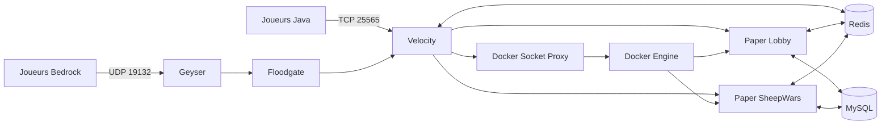

# Architecture et fonctionnement

## Vue d'ensemble

Velocity est l'unique point de routage public. Il authentifie directement les profils Java ; Geyser traduit le protocole Bedrock sur ce même proxy et Floodgate fournit une identité UUID stable sans désactiver l'`online-mode` Java. Les deux ponts restent sur Velocity, car aucun backend n'utilise leur API. Le plugin `tropicube-velocity` maintient un catalogue d'instances, restaure celles qui existent encore après son redémarrage, crée les conteneurs nécessaires et les enregistre dynamiquement auprès du proxy. Les serveurs Paper exécutent `TropicubeCore` et leur plugin spécialisé.

L'éditeur local conserve les ressources Maven comme source de vérité et leurs miroirs Docker comme source de build. Il partage le rendu des placeholders nommés via `tropicube-language-api`. Les dispositions des menus, scoreboards et tablists résident dans des manifestes versionnés propres à leur module. Après validation, l'éditeur installe langues et manifestes dans les conteneurs, puis appelle `languageeditorreload` par RCON. Core publie chaque ensemble sous une nouvelle génération Redis (`runtime-ui:generation:<id>:*`) et ne remplace `runtime-ui:active` qu'après les fichiers et leur manifeste de hashes. Une nouvelle instance vérifie puis restaure cette génération avant de charger ses gestionnaires.

Deux réseaux Docker séparent les flux :

- `tropicube-net` relie Velocity, Redis, MySQL et les serveurs de jeu ;
- `tropicube-control`, interne, relie uniquement Velocity au proxy du socket Docker.

## Cycle d'une instance

1. Au démarrage, Velocity charge les templates puis restaure les instances encore décrites dans Redis et Docker.
2. Il garantit `min-instances` pour chaque template activé avec `auto-start`.
3. `DockerManager` réserve les ports, crée le conteneur, injecte son environnement, ses labels et ses volumes, puis le démarre.
4. `TropiServerManager` attend que le backend soit joignable avant de l'enregistrer auprès de Velocity.
5. Les comptes de joueurs et l'état de l'instance sont actualisés dans Redis.
6. À la fin d'une partie, le backend demande sa clôture à Velocity. Le proxy réessaie les transferts tant que tous les joueurs ne sont pas revenus au lobby, puis tue et supprime immédiatement le conteneur.
7. Une instance vide et éligible à `auto-stop` est arrêtée après `auto-stop-delay`, sans descendre sous `min-instances`.
8. Velocity sonde toutes les 10 secondes les backends prêts. Après 60 secondes sans réponse, il force la suppression du conteneur, de son entrée Velocity et de toutes ses références Redis connues.

Les créations classiques SheepWars ne sont pas limitées à `min-instances` : dès qu'aucune instance `GAME_WAITING` ou `GAME_STARTING` n'a de place, le matchmaking partage une nouvelle création entre les joueurs en attente, jusqu'à `max-instances`. Une seule création simultanée par template est lancée afin d'éviter les doublons, puis une création suivante peut démarrer si des joueurs restent en attente.

À la fin d'une partie, seul un serveur classique sans `HOST_UUID` demande la précréation de sa relève. Une instance personnalisée s'arrête sans publier de demande `CREATE_GAME`, afin qu'une session privée ne déclenche pas une partie publique ou un conteneur inutile.

Le cycle nominal utilise `CREATING`, `STARTING`, `GAME_WAITING`, `GAME_STARTING`, `GAME_PLAYING`, `GAME_ENDING`, `STOPPING` et `STOPPED`, avec `ERROR` comme sortie d'échec. Une instance n'est joignable que si son état et sa capacité le permettent.

Chaque instance porte aussi un mode fonctionnel rétrocompatible : `LOBBY`, `QUICK_PLAY`, `RANKED_4V4`, `RANKED_8V8` ou `CUSTOM`. Les nouveaux événements réseau utilisent une enveloppe JSON versionnée avec identifiant unique, source et horodatage afin de permettre leur déduplication.

La maintenance globale ou par type est orchestrée par Velocity. Elle bloque les nouvelles entrées et créations, laisse les parties actives se terminer jusqu'à l'échéance, puis transfère vers un lobby ou déconnecte proprement. L'état court est partagé dans Redis ; les limites de connexions ne conservent que des compteurs en mémoire et des quarantaines temporaires.

Le MOTD de l'unique entrée publique Velocity affiche une accroche et les types de jeux activés, dédupliqués entre leurs différentes files. Il ne publie ni langues, ni effectif réseau, ni serveur Paper individuel.

Si un arrêt Docker échoue alors que le conteneur reste actif, Velocity restaure l'état jouable antérieur dans son registre et dans Redis. Le Lobby exclut `STOPPING`, `STOPPED` et `ERROR` de ses listes et de ses totaux ; ses menus ne comptent ainsi que les instances en démarrage ou dans un état de jeu actif.

## Responsabilités des modules

### `tropicube-language-api`

Bibliothèque Java pure partagée par Core et Velocity. Elle distingue les valeurs texte, toujours échappées, des composants Adventure riches explicitement autorisés et conserve la lecture des placeholders positionnels pendant leur migration. Un nom de placeholder représente une information métier unique et est réutilisé entre les textes qui reçoivent cette même information. Core et Velocity enrichissent chaque rendu avec `{instance_name}` : la valeur provient respectivement de l'environnement de l'instance Paper et de la connexion courante du joueur au proxy, sans décaler l'association des arguments positionnels restants. Pour les rendus destinés à un joueur, `{player_grade}` fournit uniquement son préfixe de grade formaté ; Core le résout sans SQL depuis son cache local et publie `tropicube:player:grade-display:<uuid>` dans Redis avec une durée de vie de 24 heures afin que Velocity maintienne son propre cache en mémoire. Cette valeur indépendante suit une sémantique dernier écrivain gagnant et Velocity utilise temporairement le grade par défaut tant que le premier chargement n'est pas reçu.

### `tropicube-docker-api`

Bibliothèque commune ombrée dans les plugins qui en ont besoin :

- `ServerTemplate` valide la définition d'un type de serveur ;
- `ServerInstance` représente une exécution concrète et son état ;
- `DockerManager` réserve les ports, crée, inspecte, arrête et nettoie les conteneurs ;
- `RedisManager` centralise le préfixage, la sérialisation JSON, les transactions et les abonnements avec reconnexion.

Les clients Docker et Redis sont fermables. Les abonnements Redis, bloquants par nature, tournent dans des threads virtuels et se réabonnent après une coupure tant que le gestionnaire reste actif.

### `tropicube-velocity`

Le plugin proxy :

- initialise Redis et le client Docker via le socket proxy ;
- charge les templates de `config.yml` ;
- crée, restaure, surveille et retire les serveurs dynamiques ;
- choisit le lobby le moins chargé à la connexion et comme solution de repli ;
- gère les files VIP, les transferts et leurs erreurs ;
- détient l'autorité de la whitelist d'une partie personnalisée, pour la commande, le menu et chaque tentative de connexion ;
- propose les commandes réseau et l'identité `/nick`.

À l'arrêt propre de Velocity, le comportement par défaut (`shutdown.stop-dynamic-servers: true`) arrête et supprime tous les conteneurs dynamiques. Chaque instance possède un volume `/data` éphémère nommé à partir de son identifiant et étiqueté `fr.tropicube.dynamic=true`. Velocity le supprime explicitement avec le conteneur et balaie au démarrage les volumes Tropicube devenus orphelins, même si leur conteneur a disparu brutalement. Les anciens volumes anonymes encore attachés sont également demandés à la suppression. Les volumes nommés de MySQL et Redis sont hors de ce périmètre et restent persistants. Un redéploiement qui doit préserver les parties peut temporairement utiliser la valeur `false` ; les backends sont alors restaurés au démarrage suivant.

Les images Lobby et SheepWars préparent Paper au build : `mc-image-helper` télécharge le build épinglé, puis Paperclip en mode `patchonly` récupère le JAR Mojang et génère le runtime sans démarrer de monde. L'image finale embarque le JAR Paper, `cache/mojang_<version>.jar`, `versions/<version>/paper-<version>.jar`, les bibliothèques du bootstrap et les configurations par défaut `bukkit.yml` et `paper-world-defaults.yml` dans `/data`. Docker recopie ce contenu initial dans chaque nouveau volume dynamique vide ; le démarrage d'une instance ne télécharge donc plus ni le serveur ni ces configurations. Le volume reste entièrement propre à l'instance et continue d'être supprimé avec elle.

Le répertoire d'exécution `/server` du proxy est monté en `tmpfs`. Son contenu est initialisé à chaque démarrage depuis `/opt/tropicube/server`, embarqué dans l'image, puis disparaît automatiquement à l'arrêt du conteneur. Velocity ne crée donc plus de volume anonyme persistant. Les scripts de déploiement détectent et suppriment une dernière fois l'ancien volume `/server` lors de la migration.

L'arrêt d'un conteneur est réconcilié avec son état Docker réel. Si le proxy de socket perd la réponse HTTP après avoir transmis la commande, Velocity vérifie si le conteneur est déjà arrêté ; sinon il retente une fois. L'instance n'est marquée en erreur que si les deux commandes échouent et que Docker la voit toujours active.

### `tropicube-core`

Plugin obligatoire sur chaque backend Paper. Son ordre d'initialisation est volontaire : configuration, MySQL, Redis, langues, permissions/grades, économie, données joueurs, HeadDatabase, commandes et listeners.

Il fournit :

- le profil et la langue du joueur ;
- les grades strictement cosmétiques et les profils d'accès `vipLevel`/`modLevel` ;
- l'économie et l'historique des transactions ;
- les sanctions de modération ;
- le formatage du chat et des pseudos ;
- une API Java typée consommée par Lobby et SheepWars.

Les accès MySQL potentiellement longs sont exécutés hors du thread principal dans les flux de connexion, de commande et de boutique. Les modifications Bukkit reviennent ensuite sur le thread serveur.

### `tropicube-lobby`

Le lobby prépare le joueur, fournit son inventaire de navigation et rafraîchit les données d'instances depuis Redis. Ses interfaces permettent de :

- sélectionner un type et une instance ;
- créer ou arrêter une partie personnalisée lorsque le joueur en est l'hôte ;
- changer de langue ;
- acheter un grade VIP avec compensation du débit si l'attribution échoue ;
- utiliser un, deux ou une infinité de doubles-sauts selon les permissions ;
- rejoindre la prochaine partie proposée après un match.

Les écrans Profil utilisent le même inventaire de 54 cases, le même cadrage et les mêmes contrôles que le sélecteur de serveurs et Social. Chaque action annonce explicitement son clic. Les têtes de joueur reçoivent leur profil puis un libellé `displayName` localisé explicite afin que le nom généré par Minecraft ne remplace jamais « Profil » ou « Profil complet ». Social titre sa vue principale « Social • Amis » et présente les demandes d'amis et de party selon la même grille reçues/envoyées ; une invitation de party envoyée peut être annulée au clic droit.

Une vue d'instance privée contient son indicateur de confidentialité et les UUID admis. Le lobby filtre cette vue avant les compteurs, la pagination, le meilleur serveur et le clic final : une partie privée n'est donc jamais rendue pour un joueur non admis. Velocity répète néanmoins le contrôle dans `ServerPreConnectEvent`, qui constitue la frontière de sécurité.

Le matchmaking classique est coordonné par Velocity par template. Tant qu'une création est en cours, les clics du menu et les demandes `/playnext` réutilisent la même `CompletableFuture` au lieu de créer un conteneur supplémentaire. Les UUID sont conservés dans une file FIFO dédupliquée en mémoire, puis transférés automatiquement quand l'instance est enregistrée. Si sa capacité ne suffit pas, les joueurs restants déclenchent une unique instance suivante. Ce mécanisme ne s'applique ni aux parties personnalisées ni aux créations administratives.

Le classé suit un chemin distinct. Le lobby publie temporairement cote, heure d'entrée et taille réellement transférée de la party. Velocity revalide la taille, forme un lot exact 4v4 ou 8v8, élargit la tolérance de cote avec le temps puis crée l'instance correspondante. Le chef est transféré et `PartyCoordinator` déplace uniquement les membres ayant `/party follow on`. Quick Play conserve la sélection « fill first » afin de remplir une partie jusqu'au 8v8 avant d'en ouvrir une autre.

HeadDatabase est optionnel au moment précis du rendu : une icône Material ou une tête générique est utilisée tant que sa base n'est pas chargée.

### `tropicube-sheepwars`

Une instance SheepWars suit les phases attente, sélection, compte à rebours, jeu et fin. Le module gère :

- un mode immuable `QUICK_PLAY`, `RANKED_4V4`, `RANKED_8V8` ou `CUSTOM` injecté par Docker ;
- la cote partagée des deux files, l'incertitude, les placements et les saisons trimestrielles archivées ;
- l'expérience propre à chaque kit Quick Play et une branche exclusive réversible sans effet de gameplay tant que son catalogue n'est pas approuvé ;
- l'enregistrement asynchrone des matchs et l'alimentation des missions, niveaux réseau et scores agrégés de guilde ;
- les cartes et points d'apparition rouges/bleus ;
- le choix ou vote de carte ;
- la sélection des équipes, classes et kits ;
- les règles forcées ou personnalisées ;
- l'item et les inventaires de whitelist de l'hôte privé, dont les lectures Redis sont exécutées hors du thread Paper ;
- les scores et statistiques persistantes ;
- les moutons spéciaux issus d'une table de poids immuable filtrant les types désactivés, d'un tirage pondéré indépendant à chaque remise et d'une échéance propre à chaque joueur qui reste due tant que son stock est plein ;
- les cibles aériennes de laine lumineuse, dont le gestionnaire propre à la manche teste les segments de trajectoire des flèches, applique un bonus pondéré aux survivants de l'équipe puis gère la réapparition et le nettoyage ;
- le retour au lobby et la proposition de revanche.

Les types inclus sont Boarding, TNT, Distort, Darkness, Searching, Fire, Poison, Swap, Meteor, Healing, Lightning, Gravity, Mecha, Strength et Fragmentation.

Les explosions offensives séparent désormais trois responsabilités : l'explosion Paper produit l'effet visuel et la destruction éventuelle des blocs, `PlayerListener` annule ses dégâts natifs pendant l'exécution contrôlée, puis le gestionnaire applique aux seuls ennemis un dégât radial linéaire configuré. Cette séparation empêche les doubles dégâts, dissocie le bonus du kit DPS du rayon et permet aux capacités multiples comme Fragmentation de partager un plafond par cible. Les valeurs sont chargées et validées une fois au démarrage depuis `gameplay-balance`.

### `tropicube-fallenkingdoms`

Ce module est pour l'instant un squelette Maven sans classe, ressource, dépendance Paper ni intégration Docker. Il participe au build global pour réserver son identité, mais n'est pas un plugin installable. Son futur déploiement nécessitera au minimum une classe `JavaPlugin`, un `plugin.yml`, une dépendance Paper/Core, une configuration, une image et un template Velocity.

## Contrats Redis

`RedisManager` préfixe automatiquement les clés avec `tropicube:`. Les appels applicatifs utilisent donc les noms logiques ci-dessous.

| Clé ou canal logique | Producteur | Consommateur | Fonction |
|---|---|---|---|
| `instance:<id>` | Velocity | Tous | JSON de l'instance, dont confidentialité et UUID whitelistés ; TTL 24 h renouvelé à chaque sauvegarde |
| `instances:active` | Velocity | Lobby/Velocity | Ensemble des identifiants actifs |
| `instances:type:<type>` | Velocity | Lobby/Velocity | Index par type |
| canal `servers` | Velocity | Intégrations | `SERVER_STARTED` / `SERVER_STOPPED` |
| canal `commands` | Lobby/SheepWars/Velocity | Velocity/SheepWars | Commandes ciblées, notamment `PROXY:CONNECT:<uuid>:<serveur>`, la demande acquittée `PROXY:HOST_WHITELIST:<hôte>:<opération>:<requête>:<joueur>`, sa réponse `SHEEPWARS:HOST_WHITELIST_RESULT:<hôte>:<requête>` et `PROXY:FINISH_GAME:<instanceId>` |
| canal `players` | Velocity | Intégrations | Changements de serveur d'un joueur |
| `party:member:<uuid>` | Core | Core/Velocity/Lobby | Index vers la party du joueur, TTL 24 h |
| `party:<id>:leader` / `party:<id>:members` | Core | Core/Velocity/Lobby | Chef et hash `uuid -> follow`, mis à jour atomiquement par scripts Lua, TTL 24 h |
| `sw:queue-rating:<uuid>` | Lobby | Velocity | Cote de file classée, TTL 30 min |
| `sw:queue-size:<uuid>` | Lobby | Velocity | Nombre de membres effectivement transférés, TTL 30 min |
| `sw:queue-since:<uuid>` | Lobby | Velocity | Début d'attente en millisecondes, TTL 30 min |
| `matchmaking:player:<uuid>` | Velocity | Lobby | Identifiant de l'unique file active, TTL 30 min ; remplacé atomiquement du point de vue du gestionnaire de file et supprimé à l'annulation, au transfert ou à la déconnexion |
| `matchmaking:ranked:stats:<template>` | Velocity | Lobby | Télémétrie JSON versionnée sans UUID : groupes, joueurs réservés, capacité, attente la plus longue et date de mise à jour ; TTL 15 s renouvelé toutes les 5 s |
| `sw:ranked-penalty:<uuid>` | SheepWars | Lobby | Échéance d'interdiction temporaire de file ; TTL égal à la sanction |
| `sw:left-game:<uuid>` | SheepWars | Lobby/Velocity | Instance classée à rejoindre pendant la grâce de 180 secondes |
| `contextual-hint-session:<uuid>` | Core | Core/Lobby | Verrou `SET NX EX` limitant l'aide à un message par session de douze heures |
| `staff-mode:<uuid>` / `staff-previous-mode:<uuid>` | Core | Core | Mode spectateur staff et mode de jeu à restaurer, TTL huit heures |
| `party:offline:<uuid>` | Velocity | Velocity | Instant de déconnexion persistant, TTL 24 h, supprimé à la reconnexion ou après réconciliation |
| `party:invites:<cible>` / `party:invites:sent:<chef>` | Core | Core/Lobby | Index reçus (`chef -> party`) et envoyés (`cible -> party`) d'une même invitation, avec le TTL configurable des invitations ; création, acceptation, refus et annulation mettent à jour les deux index atomiquement par scripts Lua. L'index envoyé est renseigné pour les invitations nouvelles ou renouvelées |
| canal `commands` (`PROXY:FRIEND_JOIN`, `PROXY:PARTY_WARP`) | Core | Velocity | Demandes de transfert social revalidées par le proxy |
| `transfer:<uuid>` | Velocity | Core/Lobby | Marqueur court évitant de traiter un transfert comme une première arrivée |
| `session:initial-lobby-welcome:<uuid>` | Velocity | Lobby | Marqueur à usage unique, TTL 60 s, créé seulement lorsque le premier serveur choisi après connexion au proxy est un lobby ; autorise le grand titre d'accueil puis est immédiatement supprimé |
| `host:<uuid>` | Velocity | Lobby/SheepWars | Partie personnalisée administrée par le joueur |
| `host-creation:<uuid>` | Velocity | Lobby/Velocity | Verrou atomique et temporaire empêchant deux créations personnalisées simultanées |
| `player:uuid:<pseudo>` / `player:name:<uuid>` | Velocity | Velocity/SheepWars | Résolution des membres de whitelist déjà vus ; TTL 30 jours renouvelé à la connexion |
| `post-game:<uuid>` | SheepWars | Lobby | Cible et type proposés par `/playnext`, TTL 120 s |
| `settings:auto-replay:<uuid>` | Lobby | Lobby | `OFF`, compteur restant ou `0` en attente de confirmation ; persistant dans Redis |
| `nick:<uuid>` | Velocity | Core/mini-jeux | Pseudonyme, skin et grade d'affichage factice actifs, TTL 24 h renouvelé après reconnexion |
| `player:access:<uuid>` | Core | Velocity | `vipLevel:modLevel:revision`, persistant et remis en cache localement sans I/O dans les callbacks de permissions |
| langue/cache joueur | Core | Core/Velocity | Accélération et synchronisation du profil |

Les messages de transfert ne doivent jamais appeler Bukkit depuis le thread d'abonnement Redis. Chaque plugin planifie les opérations d'entité ou d'inventaire sur le thread Paper.

Le chat global et les messages privés sont relayés par Redis. Chaque message public reçoit un identifiant aléatoire de douze caractères ; le contenu et un contexte borné aux sept messages récents de l'instance restent quinze minutes dans Redis. Seul un membre habilité voit l'action cliquable préparant `/mute ... --evidence`. La capture copie alors le message, son contexte et son empreinte SHA-256 dans MySQL pendant exactement 90 jours. L'identité de l'auteur du signalement n'est exposée que par le workflow staff. Les messages privés non livrés expirent après sept jours et les listes d'ignorés restent en MySQL.

Les bannissements sont autoritaires en MySQL et mis en cache sous `ban:<uuid>` afin que Velocity refuse la connexion avant tout transfert Paper. Une sanction nouvelle est publiée immédiatement au proxy pour expulser une session active. Les actions staff sensibles exigent en plus `staff-session:<uuid>`, session Redis persistante obtenue avec un code TOTP non rejouable ou un code de récupération à usage unique. Velocity supprime cette clé à la déconnexion réelle du réseau, mais pas lors d'un simple transfert Paper ; une clé résiduelle issue d'un arrêt brutal est également purgée à la connexion suivante. La consommation du pas TOTP ou du code de secours verrouille la ligne MySQL dans une transaction avant d'ouvrir la session, ce qui interdit deux validations concurrentes. Les secrets TOTP sont chiffrés AES-256-GCM avec une clé fournie uniquement par l'environnement ; aucune adresse IP ni donnée d'appareil supplémentaire n'est collectée.

Sur Paper, `TropicubeCore` est l'unique fournisseur d'exécution de `tropicube-docker-api`. Lobby et SheepWars le déclarent en dépendance Maven `provided` et le retrouvent via leur dépendance Paper obligatoire vers Core. Leurs JAR ombrés ne doivent jamais réembarquer `fr.tropicube.docker.*`, faute de quoi les objets sociaux échangés entre plugins appartiendraient à des classloaders incompatibles.

Core recopie le pseudonyme et le grade factice d'une identité `/nick` dans un cache visuel local lors de `NICK_APPLY`. Ce cache alimente la tablist et les annonces d'entrée du lobby, tandis que le chat lit la même identité Redis ; aucun de ces affichages ne remplace le grade réel utilisé pour les permissions. Pour `NICK_CLEAR`, Velocity conserve `nick:<uuid>` et `nick:original:<uuid>` jusqu'à ce que le backend possédant le joueur ait restauré son profil ; ce backend supprime alors les deux clés. La demande reste ainsi rejouable si un message Pub/Sub est perdu ou si le joueur change de serveur. Le cache est vidé à la désactivation du nick ou au déchargement du joueur, puis restauré depuis `nick:<uuid>` à la reconnexion. Le lobby résout le nom visible depuis `Player#displayName`, actualisé immédiatement par Core à l'activation comme à la désactivation, car le nom du profil Paper peut rester transitoirement obsolète après `setPlayerProfile`.

SheepWars consomme les événements `NICK_APPLY`, `NICK_RESET`, `NICK_CLEAR`, `GRADE_LOADED` et `GRADE_CHANGED` pour réaffirmer son rendu local après Core. Sa tablist ne reprend aucun préfixe ni icône : le `displayName` synchronisé est coloré selon l'équipe, ou en gris pour un spectateur. Le chat utilise cette même identité afin de suivre immédiatement `/nick off`. Les équipes de scoreboard continuent séparément d'utiliser le nom de profil envoyé au client pour le contour des entités.

Les instances de mini-jeu publient `GAME_WAITING`, `GAME_STARTING`, `GAME_PLAYING` puis `GAME_ENDING`. Le lobby présente `GAME_PLAYING` sous le libellé bleu `PLAYING` et autorise la connexion lorsque le jeu prend en charge l'arrivée tardive en spectateur.

Les amitiés sont lues depuis MySQL par Core. Les commandes et les menus Social du lobby n'effectuent jamais ces accès sur le thread Paper ; chaque ami, membre ou demande y est représenté par une tête liée à son UUID de profil. Social alterne entre les onglets Amis (HeadDatabase `117085`, slot 3) et Party (HeadDatabase `117095`, slot 5). Le bouton central inférieur ouvre les demandes d'amis dans le premier onglet et les invitations de party dans le second. Le sous-menu d'amis sépare les demandes reçues, acceptables par clic gauche et refusables par clic droit, des demandes envoyées, annulables par clic droit ; celui de party accepte au clic gauche et refuse au clic droit. Le Lobby initialise la résolution dynamique avec le seul UUID, résout les textures de skin de manière asynchrone côté serveur, partage les requêtes simultanées et met les profils complets en cache. Une résolution échouée ou incomplète expire après cinq secondes, affiche temporairement la tête sans texture et pourra être retentée à la prochaine ouverture. Pour rejoindre un ami, Core vérifie d'abord la relation puis publie l'instance observée ; Velocity revalide la connexion de l'ami, son instance courante, l'état, la whitelist et la capacité. En `GAME_PLAYING`, SheepWars classe déjà toute arrivée tardive comme spectateur. Lorsqu'un chef change d'instance ou exécute `/party warp`, Velocity ne transfère que les membres connectés dont le champ `follow` vaut `1` et vérifie la capacité du lot avant de lancer les connexions. `/party warp <joueur>` publie une demande distincte : Velocity revalide que l'émetteur est encore chef, que la cible appartient toujours à la party et que son instance possède une place avant de ne transférer que ce membre. L'acceptation d'une invitation vers une autre party est un script Lua unique : retrait de l'ancien groupe, promotion ou dissolution, puis insertion dans le nouveau groupe sans état intermédiaire visible.

À la déconnexion, Velocity écrit `party:offline:<uuid>` puis réconcilie le membre après `party.disconnect-grace-seconds`. Le script Lua revalide atomiquement la présence : une reconnexion conserve la party, sinon le membre est retiré. Un chef absent est remplacé par un membre encore en ligne. Dès que le dernier membre connecté part, tous les index sont supprimés et la party est dissoute sans attendre le délai individuel. Un balayage périodique reprend les marqueurs arrivés à échéance après un redémarrage du proxy.

À la fin d'une partie, le lobby consomme atomiquement `settings:auto-replay:<uuid>`. Un compteur positif déclenche `/replay` après deux secondes ; à zéro, `/replayconfirm` est exigé avant de réarmer une série. L'absence de clé ou `OFF` conserve le lien manuel historique.

La purge d'une instance supprime atomiquement son document et ses index principaux, puis balaie les références secondaires connues (`host`, serveur courant, reconnexion, abandon, revanche et post-partie). Chaque référence est relue avant suppression afin de ne pas effacer une valeur réaffectée concurremment à une autre instance.

Un changement de langue publie `LANG_CHANGED:<uuid>:<langue>` sur le canal joueurs. Le lobby reconstruit alors, sur le thread Paper, la hotbar, le scoreboard personnel et la tablist. Le scoreboard du lobby est donc entièrement localisé et reste cohérent que la langue soit changée depuis le menu ou avec `/lang`.

Le tableau de bord Profil appartient à Core et fournit une tête de joueur localisée marquée par données persistantes. Lobby la place au slot 4 et SheepWars au slot 7 uniquement durant l'attente ; Core reste l'unique gestionnaire du clic. Lobby enregistre une passerelle bornée pour ouvrir ses Paramètres depuis ce tableau de bord. Tous les inventaires Core, Lobby et SheepWars réutilisent `NetworkMenuStyle` sans dépendance métier entre jeux. Le style conserve le cadre gris/aqua et les scintillements décoratifs sur Java, mais détecte Geyser par la marque client ou le préfixe Floodgate et supprime les vitres ainsi que les faux enchantements sur Bedrock : les actions restent ainsi isolées dans l'interface tactile sans afficher d'enchantement trompeur. Le pack intégré Geyser complète cette adaptation et son mapping de textures traduit les icônes HeadDatabase statiques.

Le sélecteur de jeux route les clics sans accès bloquant : gauche vers Quick Play, droite vers le choix Ranked 4v4/8v8 et `Maj + clic gauche` vers une liste filtrée des instances publiques. Velocity publie pour chaque template et instance un `InstanceMode` (`QUICK_PLAY`, `RANKED_4V4`, `RANKED_8V8` ou `CUSTOM`) ; Lobby ne déduit donc pas la nature d'une partie à partir de son nom. Les parties personnalisées privées restent invisibles hors whitelist et leur création visible dans le sélecteur est verrouillée sous la priorité de grade VIP+.

L'achat d'un grade verrouille dans une même transaction MySQL la ligne du joueur et son compte économie, revalide le grade attendu, débite la différence de prix, écrit la transaction et élève le grade avant commit. Les caches économie et permissions ne sont invalidés qu'après succès, ce qui évite un débit sans grade ou une compensation concurrente fragile.

## Persistance MySQL

Les migrations MySQL de Core sont listées explicitement sous `db/migration/index.txt`, appliquées dans l'ordre et enregistrées dans `tropicube_schema_migrations`. Toute la préparation du schéma est protégée par le verrou consultatif MySQL `tropicube:core:schema` : les backends Paper lancés simultanément attendent donc le même propriétaire avant leurs vérifications de métadonnées et leurs DDL. Les ajouts et suppressions conditionnels consultent `information_schema.columns` afin de rester idempotents sans dépendre des variantes `ADD/DROP COLUMN IF [NOT] EXISTS` absentes de MySQL. Les tests comparent l'index à toutes les ressources SQL et interdisent ces syntaxes incompatibles afin qu'une migration ajoutée ne puisse pas être ignorée ou casser silencieusement le démarrage.

La progression réseau suit une courbe stable : le niveau `n` commence à `100 × (n-1)²` XP. Core charge ce niveau à la connexion et l'affiche dans la barre d'expérience ; sa jauge représente la progression vers le niveau suivant et se rafraîchit après chaque gain d'XP ou récompense de mission. Les rotations personnelles utilisent le fuseau `Europe/Paris`, une clé par date ou semaine ISO, cinq emplacements quotidiens et trois hebdomadaires. Deux rerolls quotidiens sont accordés par défaut, deux supplémentaires via `tropicube.missions.reroll.bonus`. La réclamation marque la mission, crédite la monnaie, journalise la transaction et ajoute l'XP dans une même transaction SQL afin d'empêcher les doubles récompenses.

Les notifications conservent une clé de message, ses arguments et une action strictement validée pendant sept jours. La pagination, les filtres, la lecture et la suppression sont toujours bornés au propriétaire. Les exports de confidentialité sont produits hors thread Paper dans le dossier privé du plugin, supprimés après sept jours et ne collectent aucune donnée nouvelle. L'anonymisation attend trente jours et reste en `LEGAL_HOLD` tant qu'une sanction active ou une preuve de signalement encore requise existe.

À la rotation trimestrielle SheepWars, l'instance qui observe la nouvelle saison archive les cotes et compte les parties classées. Les clés primaires `(season_id, player_uuid)` rendent l'archive et l'attribution de récompense idempotentes entre instances concurrentes. Seuls les joueurs sans placement restant reçoivent monnaie, titre et badge ; la cote courante subit ensuite le reset souple lors de son premier chargement dans la nouvelle saison.

Les guildes sont persistantes et indépendantes des parties. `OWNER`, `OFFICER` et `MEMBER` déterminent les mutations autorisées ; la capacité et le nombre d'officiers sont validés côté SQL. Chaque gain d'XP réseau provenant d'une partie ou d'une mission déclenche une contribution asynchrone, plafonnée par membre et semaine, qui fait progresser le niveau de guilde et le défi `CONTRIBUTION`. Les parties classées alimentent séparément `RANKED_MATCHES` et le score saisonnier agrégé. Un balayage quotidien remplace un chef inactif depuis 30 jours par le membre actif ayant rejoint le plus tôt ; chaque transition est auditée.

Le profil agrège identité, niveau, solde, relations, guilde et statistiques SheepWars. Un tiers reçoit soit le résumé public, soit les détails réservés aux amis, soit aucun contenu selon la préférence persistante. Le lobby charge ces préférences hors thread Paper, masque seulement les entités selon `EVERYONE`, `FRIENDS`, `PARTY` ou `NOBODY`, puis réapplique le filtre après une arrivée ou un changement. Son sélecteur intelligent privilégie une partie dont le compte à rebours est lancé puis remplit la partie la plus avancée disposant d'assez de places.

`DatabaseManager` crée et fait évoluer les tables suivantes au démarrage :

- `tropicube_players` : identité, langue et métadonnées du joueur ;
- `tropicube_economy` : solde courant ;
- `tropicube_transactions` : journal des mouvements ;
- `tropicube_sanctions` : mutes, avertissements et expulsions ;
- `tropicube_grades` : affichage cosmétique et niveaux par défaut des grades ;
- `tropicube_access_audit` : journal des changements de grade et de niveaux, conservé 365 jours par défaut ;
- `tropicube_sheepwars` : choix de kit historique ;
- `tropicube_sheepwars_matches` et `tropicube_sheepwars_match_players` : historique détaillé et cotes avant/après ;
- `tropicube_sheepwars_ratings` : cote unique 4v4/8v8, incertitude, placements et saison ;
- `tropicube_sheepwars_kit_mastery` : XP par kit et branche exclusive ;
- `tropicube_sheepwars_abandons` et `tropicube_sheepwars_preferences` : sanctions graduées et visibilité des détails ;
- `tropicube_sheepwars_season_ratings`, `tropicube_profile_titles`, `tropicube_profile_badges` et `tropicube_season_reward_grants` : archives et récompenses saisonnières idempotentes ;
- `tropicube_notifications`, `tropicube_contextual_hints` et `tropicube_privacy_requests` : centre joueur, aide persistante et workflow de confidentialité ;
- `tropicube_friendships` : paire canonique de joueurs, demandeur, état `PENDING`/`ACCEPTED` et dates ; index par membre, état et ancienneté.

Les grades déclarés dans la configuration Core sont resynchronisés au démarrage. Une modification manuelle en base ou via la sous-commande de définition de grade peut donc être écrasée par la configuration au prochain redémarrage.

## Sécurité réseau

- Velocity authentifie les comptes (`online-mode = true`).
- Geyser écoute uniquement le port public UDP configuré ; Floodgate chiffre ses données avec la clé privée persistée dans `floodgate-data`.
- Les backends Paper sont hors ligne car ils font confiance au forwarding moderne de Velocity.
- `paper-global.yml` exige le même `FORWARDING_SECRET` que `forwarding.secret` côté proxy.
- Redis et MySQL ne sont publiés que sur la boucle locale de l'hôte.
- Le proxy Docker limite les familles d'appels exposées et utilise `no-new-privileges`.
- Les conteneurs dynamiques reçoivent uniquement les secrets nécessaires via leur environnement.
